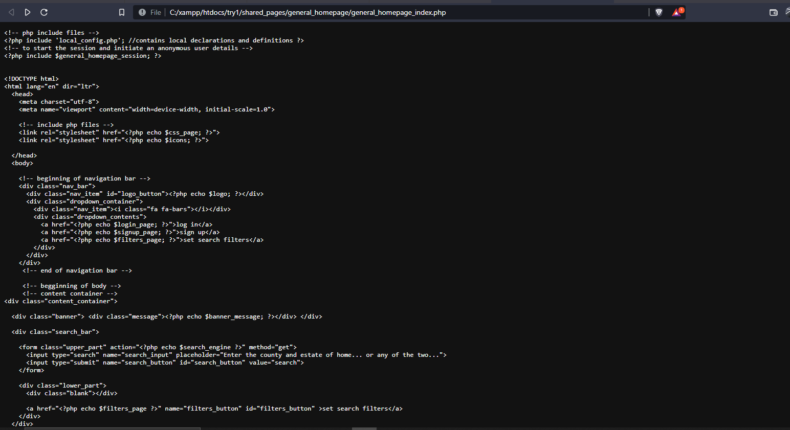
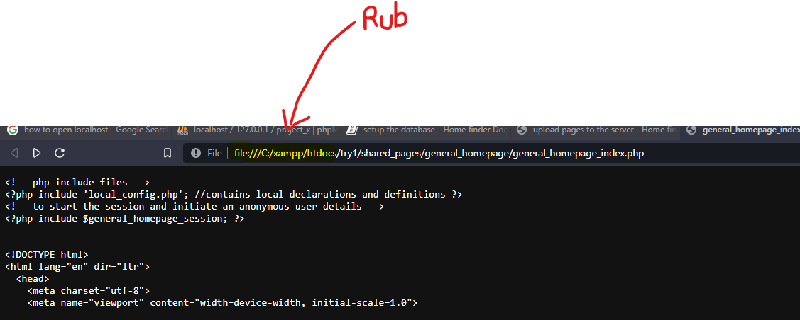
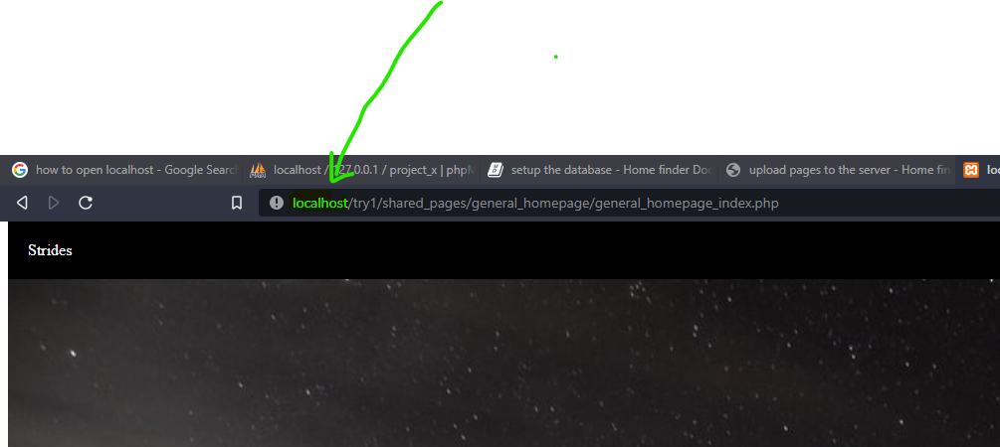

# Running the website

## Intro

As you already know, for you to access websites, ou have to be connected to a server ia the internet.\
But in our case, our computer is both the client and the server.\
For you to access the website, you have to "create a form of Internet" by switching on the server anytime you want to run the website.

## open the homepage using a browser.

1. Make sure that the XAMPP server is running and both Apache and Mysql modules have already started

2. Navigate to : C:\xampp\htdocs\try1\shared_pages\general_homepage\

3. Open : general_homepage_index.php using a browser of your choice.\
   You will see a page like this :

   

## make the page user-friendly

1. You will rub off the highlighted part of the URL and replace it with the word localhost.

As follows:
- Rub of the "file:///C:/xampp/htdocs" part of the URL

- Replace the rubbed part with "localhost"

- reload the page.

# Now you can use the website as you wish.
  That was a tough job.\
  It shouldn't be that way, sorry. 😅 
