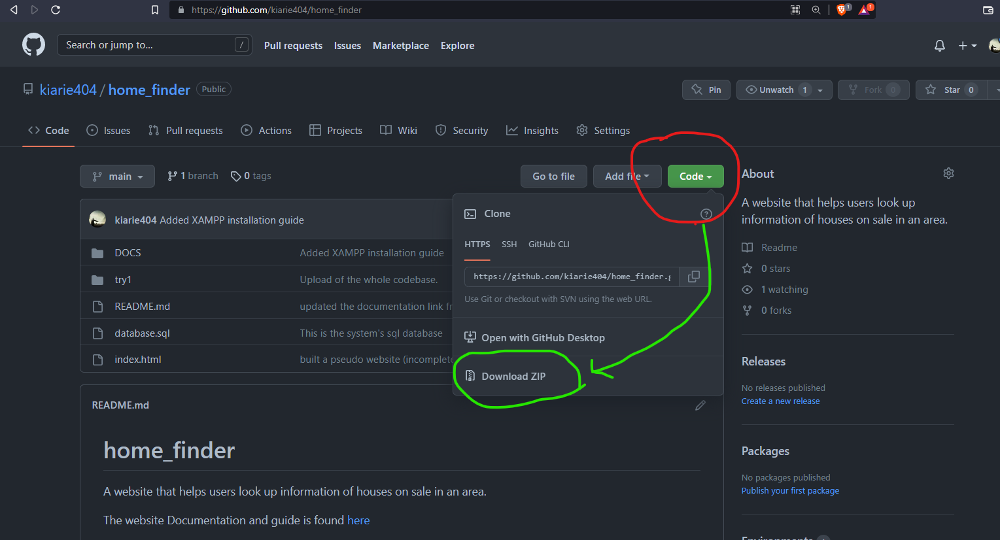
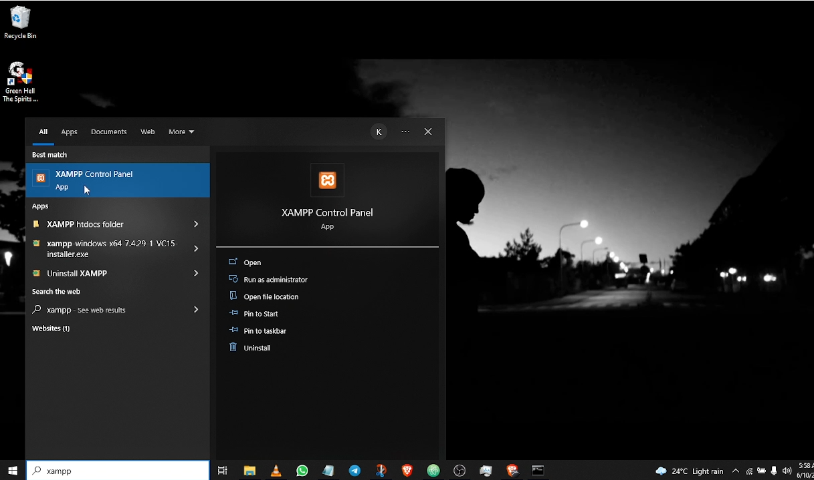
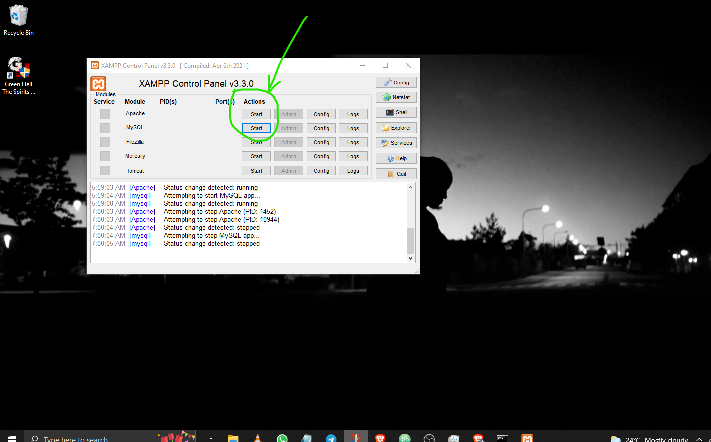
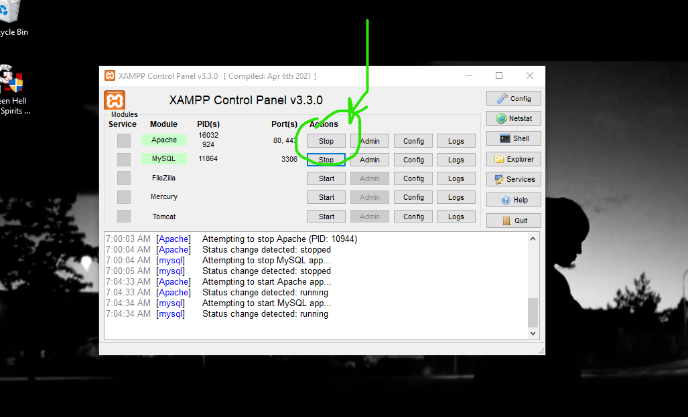
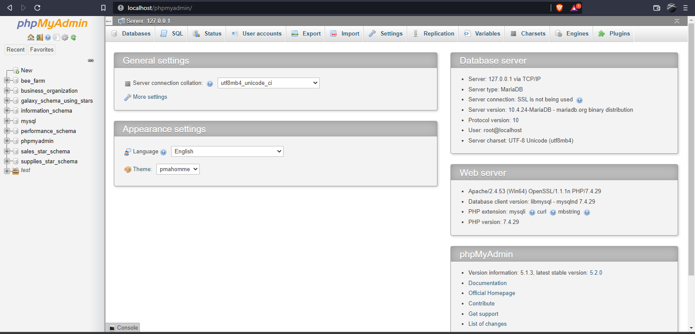
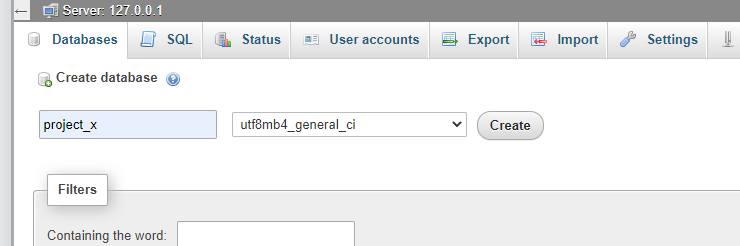

# setup the database

Now it is time to import the database.
This is going to be tricky.

## Download the database .sql file

1. visit [this page](https://github.com/kiarie404/home_finder "where the database.sql is found")

2. press the button named "code" as seen in the image below :\
   Download the zipped code.

3. Extract the zipped package. Let us refer to the unzipped package as "unzipped_folder" from here on... cool? --- cool.

## Start the Xampp server.

1. Open up the xampp control panel as shown below:

      

2. You will get something like this :

      

      Click start on the two circled buttons, that way you make the server to be ready to deal with sql databases.

3. You will get something like this :

      

## Create dummy database that has the same name as the database to be imported

1. Start up your browser.

2. In the search bar, type and search : "http://localhost/phpmyadmin/".\
   You will get a screen like this :

   

3. Press "New" to create a new database, Explicitly name it : "project_x".\
   The naming is VERY IMPORTANT. Name it "project_x"

   

## Import the database.sql to Xampp server

1. Under the project_x database, click the "import" button.

2. click the "choose file" button.

3. Navigate to the "unzipped file" and choose the database.sql file.

4. Press "Go" at the bottom of the screen

## Hurray, Phew.

So I assume you succeeded in importing this whole thing.\
The hard part is done.\
You are now like Thanos ; "***It is done***."\
***Mama I touched the net.***     
